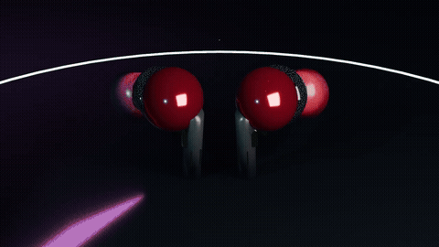
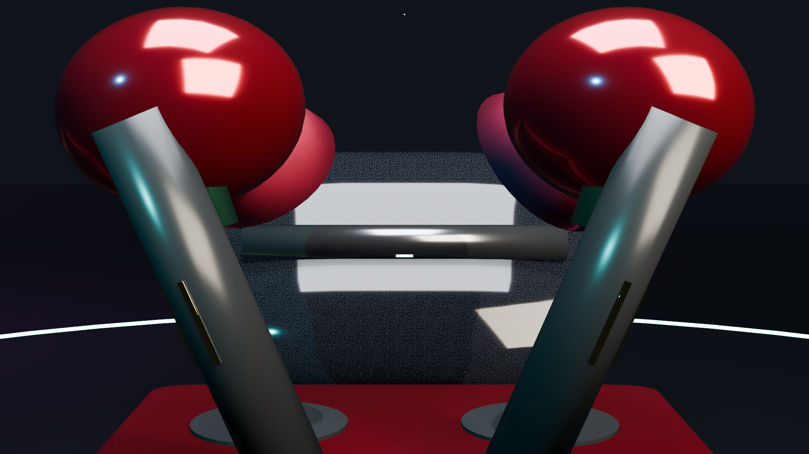
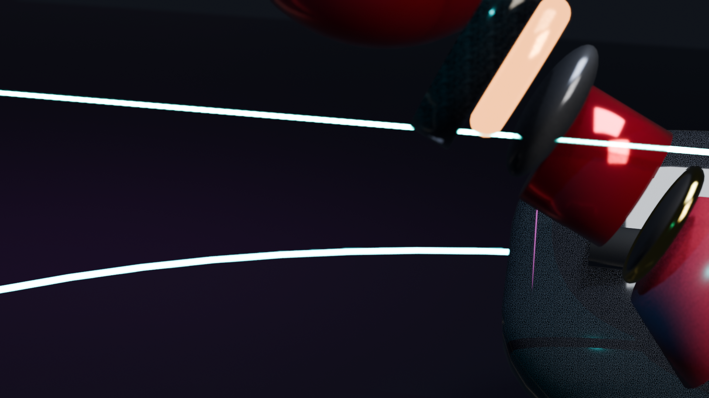

# 🎧 boAt Airdopes 3D Flagship Commercial (60 FPS Hyper-Physics)

<p align="center">
  
</p>

<p align="center">
  <a href="https://a-941.github.io/boat-3d-airbuds-commercial/"></a>
  
  
  
  
</p>

---

## 🌟 24/7 Public Interactive Web Showcase
Even when your laptop is turned off, anyone worldwide on mobile, tablet, or PC can watch the commercial in 60 FPS and interact with the earbuds in full 3D:
👉 **[Launch Live 3D Web Showcase](https://a-941.github.io/boat-3d-airbuds-commercial/)**

---

## 🎬 Cinematic Highlights & Physical Simulation

| Phase | Frames | Dynamics & Choreography |
|---|---|---|
| **Phase 1: Gravitational Slam & Elastic Rebound** | 1 – 45 | The charging case falls from $Z = 4.5\text{m}$ under realistic gravity, slams onto the dark obsidian pedestal at Frame 22 with elastic bounce ($12\text{cm}$ vertical recoil + torque), micro-shudders, ground shockwave, and handheld camera recoil. |
| **Phase 2: Pneumatic Spring Lid & High-Torque Launch** | 30 – 85 | High-tension spring snaps the translucent smoked crystal lid open to $-136^\circ$ with damper rebound. Both earbuds rocket out with high angular velocity, spinning across all 3 axes into zero-G apex. |
| **Phase 3: Bullet-Time Exploded Tech Anatomy** | 90 – 145 | Matrix slow-motion time dilation ("10⁴³ FPS" feel). Cyber laser plane sweeps down while all 8 acoustic layers explode outward: translucent ruby tips, 24K gold mesh, titanium nozzles, graphene diaphragms, **pure copper voice coils spinning 720° glowing amber**, neodymium magnets, and circuit PCBs. Magnetically snaps together at Frame 142. |
| **Phase 4: Dual Soundwave Shockwaves & Dogfight Corkscrew** | 145 – 235 | Dual concentric soundwave rings (Neon Cyan Sub-Bass & Neon Magenta Punch) expand radially up to $9.5\text{m}$. Earbuds dive into an aggressive double-helix dogfight corkscrew around the camera with whip-pan tracking. |
| **Phase 5: Grand Hero Presentation & Loop** | 240 – 360 | Aerodynamic air-brake into symmetrical three-quarters hero presentation pose displaying 24K gold boAt anchor badges, glowing cyan LEDs, translucent ruby tips, and the open crystal case with 5-bar battery equalizer HUD. Settles into docks at Frame 360 for an infinite loop. |

---

## 🖼️ Beauty Renders

### 1. Grand Hero Climax (Three-Quarters Duo Profile)


### 2. Bullet-Time Exploded Tech Anatomy


---

## 🛠️ Tech Stack & Architecture

- **3D Modeling & Animation**: Blender 5.2 LTS (Procedural Python API)
- **Render Engine**: Blender EEVEE Next (AgX Color Management, Screen Space Reflections, Subsurface Scattering, Motion Blur)
- **Video Compression**: FFmpeg H.264 60 FPS (CRF 18, YUV420p)
- **Web 3D Interactive**: Three.js WebGL (ACESFilmic Tone Mapping, PBR Physical Materials)
- **Hosting**: GitHub Pages (24/7 Global CDN)

---

## 🚀 How to Run Locally

### Prerequisites
- [Blender 5.2+](https://www.blender.org/)
- Python 3.10+
- (Optional) [FFmpeg](https://ffmpeg.org/) for video compilation

### 1. Clone the Repository
```bash
git clone https://github.com/A-941/boat-3d-airbuds-commercial.git
cd boat-3d-airbuds-commercial
```

### 2. Open Master Scene in Blender
```bash
blender boat_earbuds.blend
```
Press <kbd>Spacebar</kbd> in Blender to start real-time 60 FPS playback!

### 3. Regenerate or Re-render from Code
```bash
blender -b -P generate_boat_earbuds.py
```

### 4. Run Web Showcase Locally
Simply open `index.html` in any web browser or start a local server:
```bash
python -m http.server 8000
```
Then visit `http://localhost:8000`.

---

## 📄 License
This project is open source and available under the [MIT License](LICENSE).
